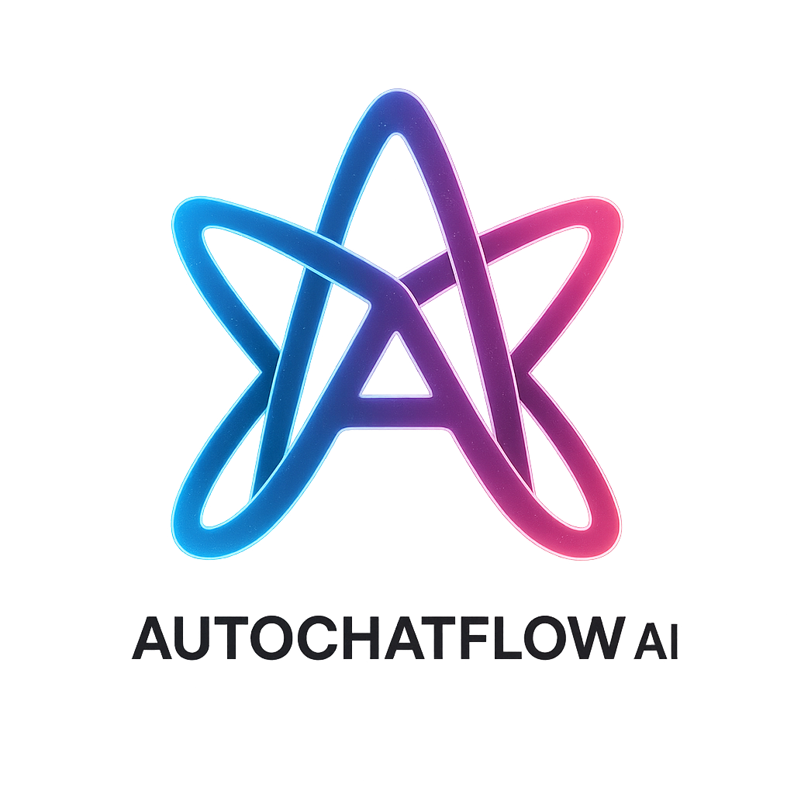

  

<h1 align="center">AutoChatFlow AI – Privacy Policy Site</h1>

  GDPR-compliant, enterprise-grade multilingual privacy policy for AI systems.
   
  <strong>Built for trust. Designed for clarity.</strong>

  <a href="https://your-github-username.github.io/your-repo-name/en/privacy.html">🌐 View Live Site</a> • 
  <a href="#-features">Features</a> • 
  <a href="#-tech-stack">Tech Stack</a> • 
  <a href="#️-project-structure">Structure</a> • 
  <a href="#-license">License</a>

---

## 🖼️ Preview

> Multilingual Privacy & Terms pages with dark-mode-ready design and language switcher.

---

## 🚀 Live Preview

- [English Privacy Policy](https://your-github-username.github.io/your-repo-name/en/privacy.html)
- [Politique de Confidentialité (FR)](https://your-github-username.github.io/your-repo-name/fr/politique.html)

> ✏️ *Replace the URLs above with your actual GitHub Pages links.*

---

## ✨ Features

- 🔐 GDPR, ISO 27001 & SOC 2 Type II compliant content
- 🌍 Bilingual (English & French) user interface
- 📱 Fully responsive with Tailwind CSS
- 🔄 JavaScript-based language switcher
- 📌 Legal metadata: effective date, version, next review
- 📥 Download requests, deletion, correction: mailto quick actions
- 🧠 Optimized for SEO & accessibility

---

## 🛠 Tech Stack

| Tech        | Use                                  |
|-------------|---------------------------------------|
| HTML5       | Semantic layout                      |
| TailwindCSS | Responsive styling                   |
| JavaScript  | Language toggle                      |
| GitHub Pages| Static hosting                       |

---

## 🗂️ Project Structure

